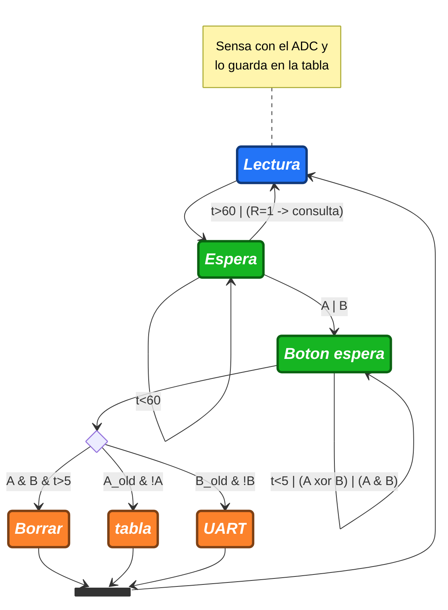

# Cosas importantes para el projecto

```mermaid
stateDiagram-v2
direction TB


classDef fSetting font-weight:bold,font-style:italic,font-size:20px
classDef blue fill:#2374f7,stroke:#113a7b,stroke-width:3px,color:#fff
classDef pink fill:#eb3dd6,stroke:#751e6b,stroke-width:3px,color:#fff
classDef orange fill:#fc822b,stroke:#7e4115,stroke-width:3px,color:#fff
classDef red fill:#ed2633,stroke:#761319,stroke-width:3px,color:#fff
classDef green fill:#16b522,stroke:#0a6211,stroke-width:3px,color:#fff


s0: Lectura
s1: Espera
s2: Boton espera
s3: Borrar
s4: tabla
s5: UART
state if_else <<choice>>
state join_state <<join>>

note left of s0
    Sensa con el ADC y
    lo guarda en la tabla
end note

s0 --> s1
s1 --> s0 : t>60 | (R=1 -> consulta)
s1 --> s1 : t<60
s1 --> s2 : A | B
s2 --> s2 : t<5 | (A xor B) | (A & B)
s2 --> if_else
if_else --> s3 : A & B & t>5
if_else --> s4 : A_old & !A
if_else --> s5 : B_old & !B
s3 --> join_state
s4 --> join_state
s5 --> join_state
join_state --> s0

class s0 blue
class s0 fSetting
class s1, s2 green
class s1, s2 fSetting
class s3, s4, s5 orange
class s3, s4, s5 fSetting
```

