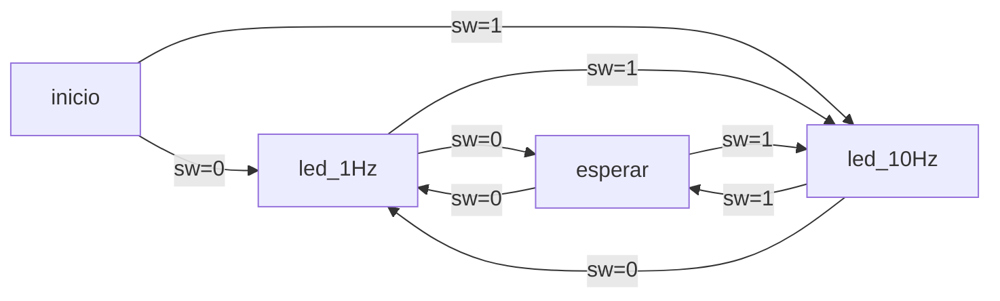

# TP2

## Bibliografia usada

- [STM32f103xx reference manual](https://www.st.com/resource/en/reference_manual/rm0008-stm32f101xx-stm32f102xx-stm32f103xx-stm32f105xx-and-stm32f107xx-advanced-armbased-32bit-mcus-stmicroelectronics.pdf).
- [Bit-band explanation](https://atadiat.com/en/e-bit-banding-explained-a-feature-of-arm-cortex-m3/).
- [Cortex-M3 technical manual](https://www.keil.com/dd/docs/datashts/arm/cortex_m3/r2p0/ddi0337g_cortex_m3_r2p0_trm.pdf).
- [STM32f103x8 datasheet](https://www.st.com/resource/en/datasheet/stm32f103c8.pdf).

## Ejercicio 1

Yendo a la seccion `9.2.2` donde se ve como funciona el registro `GPIOx_CRH` para configurarlo. En este hay dos variables que controlan los pines:

- `CNF13` : Controla el modo en que funcion el pin.
- `MODE13` : Controla la frecuencia de swichting del pin.

Podemos poner `CNF13` en 01 para que este en open drain y el `MODE13` en 11 para que funcione en la maxima frecuencia. Cabe aclarar que este registro para el port C esta en 0x4001 1004. Con esto hay que modificar el registro `GPIOx_ODR` que permite setear los pines por separado de modo que el bit `ODR13` se tiene que poner en 0 para que la salida sea nula y por lo tanto el led se prenda.

Para el `b` entiendo que el bit-band se puede hacer tal que:

- `bit-band region periphericals` = 0x40000000
  - Esta es donde estan los bits que pueden ser cambiados.

* `bit-band alias periphericals` = 0x42000000
  - Aca estan los alias que se cambian para modificar los bits en la bit-band region.
* `bit-word offset` es la posicion del bit respecto al origen del bit-band.

Entonces, se puede saber el alias tal que:

bit*word_alias_add = bit_band_region + bit_word_offset = 0x4200 0000 + (0x04 + 0x02 + 0x0001 1000) * 32 + 0x06 \_ 4

En este caso los bits 5-4 son para el MODE13 y los bits 7-6 para el CNF13.

## Ejercicio 2

El HSI tiene un 1% de error de fabrica a 25°C por lo que en 300 segundos puede tener hasta 3 segundos de error, en cambio con el oscilaor a cristal tenes un error de 0,001% que equivale a 3 ms de error en el plazo a medir de tiempo.

## Ejercicio 3

Aca usamos un par de datasheets distintos para ver las cosas, de modo que:

- `BASEPRI`: Controla que numero de prioridad + subprioridad modifica a las interrupciones.
- `AIRCR`: Controla el `PRIGROUP` que es de 3 bits donde se determina cuantos bits se toman como prioridad y cuantos como subprioridad.

Como cuanto menor sea el `PRI_n` mayor la prioridad, desde el grafico se observa que el 0101 que comienza deberia tener menor prioridad que el 0100, pero como espera a que termine entonces ambos deben pertenecer a la misma prioridad. Esto significa que como mucho los primeros 3 bits son de prioridad.

Sin embargo el 0110 deberia tener menor prioridad pero se ejecuta cortando a 0100 lo cual indica mayor prioridad lo que no tiene sentido.

## Ejercicio 4

El codigo que aparece al hacer la funcion es:

```arm
...

El llamado a la funcion es:

  variable = fun1(1,1);
 800015c:	2101      	movs	r1, #1
 800015e:	2001      	movs	r0, #1
 8000160:	f000 f864 	bl	800022c <fun1>
 8000164:	4603      	mov	r3, r0
 8000166:	4a01      	ldr	r2, [pc, #4]	; (800016c <main+0x20>)
 8000168:	6013      	str	r3, [r2, #0]

 ...

int fun1(int a, int b){
 800022c:	b480      	push	{r7}
 800022e:	b087      	sub	sp, #28
 8000230:	af00      	add	r7, sp, #0
 8000232:	6078      	str	r0, [r7, #4]
 8000234:	6039      	str	r1, [r7, #0]
int x = 13;
 8000236:	230d      	movs	r3, #13
 8000238:	617b      	str	r3, [r7, #20]
int c = 1;
 800023a:	2301      	movs	r3, #1
 800023c:	613b      	str	r3, [r7, #16]
int y = 8;
 800023e:	2308      	movs	r3, #8
 8000240:	60fb      	str	r3, [r7, #12]
int z = x+c+y+a+b;
 8000242:	697a      	ldr	r2, [r7, #20]
 8000244:	693b      	ldr	r3, [r7, #16]
 8000246:	441a      	add	r2, r3
 8000248:	68fb      	ldr	r3, [r7, #12]
 800024a:	441a      	add	r2, r3
 800024c:	687b      	ldr	r3, [r7, #4]
 800024e:	4413      	add	r3, r2
 8000250:	683a      	ldr	r2, [r7, #0]
 8000252:	4413      	add	r3, r2
 8000254:	60bb      	str	r3, [r7, #8]
return z;
 8000256:	68bb      	ldr	r3, [r7, #8]
}
 8000258:	4618      	mov	r0, r3
 800025a:	371c      	adds	r7, #28
 800025c:	46bd      	mov	sp, r7
 800025e:	bc80      	pop	{r7}
 8000260:	4770      	bx	lr
```

La declaracion de la funcion comenzo en la direccion 800022c, que llama desde el main con la linea 8000160 donde va a ese lugar de memoria y hace las operaciones.

Por otro lado los valores de los elementos los pasa con la funcion `movs` que pasa los valores a los registros r1 y r0 para poder tener guardados los valores en la funcion.

La suma se lleva a cabo por esta secuencia:

```arm
 8000242:	697a      	ldr	r2, [r7, #20]
 8000244:	693b      	ldr	r3, [r7, #16]
 8000246:	441a      	add	r2, r3
```

donde `ldr` carga en los registros lo que estaba en `[r7, #20]` y `[r7, #16]`, que antes habian guardado las variables c y x, para despues con `add` sumarlos.

El `pop` o `push` lo usa para guardar (push) o sacar (pop) lo que esta en `r7` que despues saca al terminar la funcion. No entendimos muy bien que hace con todas las funciones en particular pero bueno.

En cuanto a lo que implementa el `while(1)`, ocurre lo siguiente:

```arm
800016a:	e7fe      	b.n	800016a <main+0x1e>
 800016c:	20000028 	.word	0x20000028
```

## Ejercicio 5

La direccion base del RCC (Reset and clock control) es `0x4002 1000`.

Asumiendo que nuevamente se quiere habilitar el pin del led incluido (GPIOC, PIN*13), de modo que se trabaja en el bus `APB2`. Ademas, para los clocks necesarios se tiene que el registro \_APB2 peripherical clock enable register (RCC_APB2ENR)* en el offset 0x18 permite habilitar el clock para el GPIOC con el bit 4 en alto.

Los ultimos 3 puntos parecen una repeticion de lo que se hizo en el primero, por lo que procedo a no repetirlo. Entiendo que en definitiva es volver a la seccion _9_ donde se ve toda la configuracion.

Igualmente entiendo que seria algo como esto:

```c
#define RCC_BASE 0x40021000
#define OFFSET_APB2ENR 0x18
#define BIT_PERIFERICO 0x04

#define GPIOC_BASE 0x40011000
#define GPIOC_CRH_OFFSET 0x04
#define GPIOC_CRH_PIN13_OFFSET 20
#define GPIOC_ODR_OFFSET 0x0C
#define GPIOC_ODR_PIN13_OFFSET 13

uint32_t *const RCC_APB2ENR = RCC_BASE + OFFSET_APB2ENR;
uint32_t *const GPIOC_CRH = GPIOC_BASE + GPIOC_CRH_OFFSET;
uint32_t *const GPIOC_ODR = GPIOC_BASE + GPIOC_ODR_OFFSET;

int main(){
    // habilita el clock para el GPIOC
    *RCC_APB2ENR |= ( 1 << BIT_PERIFERICO);

    // habilita el pin del PIN 13 como salida a 2 MHz de ancho de banda
    *GPIOC_CRH &= ~( 0xF << GPIOC_CRH_PIN13_OFFSET );
    *GPIOC_CRH |= ( 0b0010 << GPIOC_CRH_PIN13_OFFSET );

    // enciende el led
    *GPIOC_ODR |= ( 1 << GPIOC_ODR_PIN13_OFFSET );

    return 0;
}
```

## Ejercicio 6

```c

#define ITER_ESPERA 400000

//declaracion de las funciones
void configurar_led();
void prender_led();
void apagar_led();
void esperar(uint32_t tiempo);

void main()
{
    configurar_led();
    while(1){
        prender_led();
        esperar(ITER_ESPERA);
        apagar_led();
        esperar(ITER_ESPERA);
    }
}


void configurar_led(){

    const uint32_t GPIOC_BASE 0x40011000;
    const uint32_t GPIOC_CRH_OFFSET 0x04;
    const uint32_t GPIOC_CRH_PIN13_OFFSET 20;
    const uint32_t  RCC_BASE 0x40021000;
    const uint32_t  OFFSET_APB2ENR 0x18;
    const uint32_t  BIT_PERIFERICO 0x04;

    uint32_t *const RCC_APB2ENR = RCC_BASE + OFFSET_APB2ENR;
    uint32_t *const GPIOC_CRH = GPIOC_BASE + GPIOC_CRH_OFFSET;

    // habilita el clock para el GPIOC
    *RCC_APB2ENR |= ( 1 << BIT_PERIFERICO);

    // habilita el pin del PIN 13 como salida a 2 MHz de ancho de banda
    *GPIOC_CRH &= ~( 0xF << GPIOC_CRH_PIN13_OFFSET );
    *GPIOC_CRH |= ( 0b0010 << GPIOC_CRH_PIN13_OFFSET );
}


// implementacion de las funciones
void prender_led(){
    const uint32_t GPIOC_ODR_OFFSET 0x0C;
    const uint32_t GPIOC_BASE 0x40011000;
    const uint32_t GPIOC_ODR_PIN13_OFFSET 13;
    uint32_t *const GPIOC_ODR = GPIOC_BASE + GPIOC_ODR_OFFSET;

    // enciende el led
    *GPIOC_ODR |= ( 1 << GPIOC_ODR_PIN13_OFFSET );
}

void apagar_led(){
    const uint32_t GPIOC_ODR_OFFSET 0x0C;
    const uint32_t GPIOC_BASE 0x40011000;
    const uint32_t GPIOC_ODR_PIN13_OFFSET 13;
    uint32_t *const GPIOC_ODR = GPIOC_BASE + GPIOC_ODR_OFFSET;

    // apaga el led
    *GPIOC_ODR &= ~( 1 << GPIOC_ODR_PIN13_OFFSET );
}

void esperar(uint32_t iter){
    for(uint32_t i = 0; i < iter; i++);
}
```

Faltaria todo lo de hacer con el analizador logico y ajustar la cantidad de iteraciones para llegar a que sea de a 10 Hz con el loop.

## Ejercicio 7

Para agregar el pulsador utilizaria lo mismo que en el 6 pero ahora tengo que crear dos nuevas funciones y modificar el main. Para hacerlo, voy a poner un switch en el pin 10 del GPIOC para poder reutilzar algo del codigo anterior.

Funciones:

```c
void configurar_switch(){
    const uint32_t GPIOC_BASE 0x40011000;
    const uint32_t GPIOC_CRH_OFFSET 0x04;
    const uint32_t GPIOC_CRH_PIN10_OFFSET 8;
    const uint32_t GPIOC_ODR_OFFSET 0x0C;
    const uint32_t GPIOC_ODR_PIN10_OFFSET 10;
    const uint32_t  RCC_BASE 0x40021018;
    const uint32_t  OFFSET_APB2ENR 0x18;
    const uint32_t  BIT_PERIFERICO 0x04;


    uint32_t *const GPIOC_CRH = GPIOC_BASE + GPIOC_CRH_OFFSET;
    uint32_t *const GPIOC_ODR = GPIOC_BASE + GPIOC_ODR_OFFSET;
    uint32_t *const RCC_APB2ENR = RCC_BASE + OFFSET_APB2ENR;

    // habilita el clock para el GPIOC
    *RCC_APB2ENR |= ( 1 << BIT_PERIFERICO);

    // habilita el pin 10 como input con pull-down
    *GPIOC_CRH &= ~( 0xF << GPIOC_CRH_PIN10_OFFSET );
    *GPIOC_CRH |= ( 0b1000 << GPIOC_CRH_PIN10_OFFSET );

    // como ODR viene en reset lo dejo como esta y ya esta en pull-down
}

uint8_t leer_switch(){
    const uint32_t GPIOC_BASE 0x40011000;
    const uint32_t GPIOC_IDR_OFFSET 0x08;
    const uint32_t GPIOC_ODR_PIN10_OFFSET 10;

    uint32_t *const GPIOC_IDR = GPIOC_BASE + GPIOC_IDR_OFFSET;

    return (*GPIOC_IDR) & ( 1 <<  GPIOC_ODR_PIN10_OFFSET );
}
```

Ademas el main se debe modificar para poder hacer los cambios necesarios tal que:
```c

enum state{inicio, led_1Hz, led_10Hz};
enum led{encendido, apagado};

void main(){
    enum state maquina;
    enum led previo_led;
    uint8_t sw;
    maquina = inicio;

    while(1){
        sw = leer_switch();

        switch(maquina){
            case inicio:
                configurar_switch();
                configurar_led();
                apagar_led();
                if (sw != 0) maquina = led_10Hz;
                else maquina = led_1Hz;
                break;

            case led_1Hz:
                if(previo_led == apagado) {
                    prender_led();
                    previo_led = encendido;
                }
                else {
                    apagar_led();
                    previo_led = apagado;
                }
                wait_time = 1;
                maquina = esperar;
                if (sw != 0) maquina = led_10Hz;
                break;

            case led_10Hz:
                if(previo_led == apagado) {
                    prender_led();
                    previo_led = encendido;
                }
                else {
                    apagar_led();
                    previo_led = apagado;
                }
                wait_time = 10;
                maquina = esperar;
                if (sw == 0) maquina = led_1Hz;
                break;

            case esperar:
                esperar(wait_time);
                if(sw != 0) maquina = led_10Hz;
                else maquina = led_1Hz;
                break;
        }
    }
}
```

Con esto deberia ser suficiente para hacer que lo detecte, teniendo el cuenta que la espera es bloqueante y no podra cambiar mientras espera, unicamente durante los cambios de estados para la maquina.

Un diagrama de estados parecido es el siguiente:



## Ejercicio 8

Para esto usamos el el timer 2 porque es mas simple que el 1 de usar, y no necesitamos mucha cosa para hacerlo andar. Para esto hay que tener en cuenta que el timer funcionara en funcion del clock seleccionado originalmente, que en el caso de los proyectos nuestros es de 72 MHz.

Por lo tanto, para hacer una funcion que dado un entero pare cierta cantidad de ms, se puede plantear lo siguiente:

```c
void wait_ms(uint32_t ms){
    
}
```
