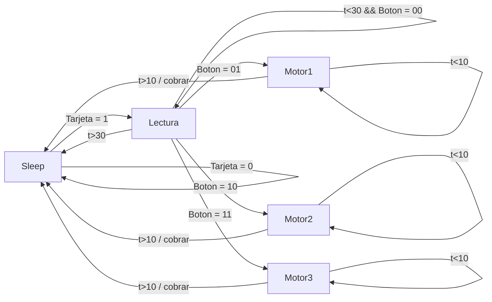

# TP3

## Ejercicio 1

```mermaid
flowchart LR
Sleep -- Tarjeta = 0 --> Sleep
Sleep -- Tarjeta = 1 --> Lectura
Lectura -- t<30 && Boton = 00 --> Lectura
Lectura -- t>30 --> Sleep
Lectura -- Boton = 01 --> Motor1
Lectura -- Boton = 10 --> Motor2
Lectura -- Boton = 11 --> Motor3
Motor1 -- t<10 --> Motor1
Motor1 -- t>10 / cobrar --> Sleep
Motor2 -- t<10 --> Motor2
Motor2 -- t>10 / cobrar --> Sleep
Motor3 -- t<10 --> Motor3
Motor3 -- t>10 / cobrar --> Sleep
```

## Ejercicio 2

